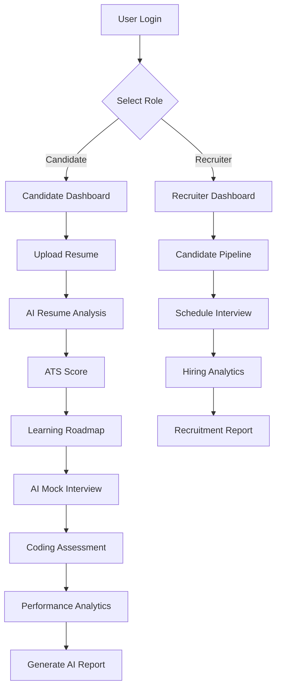

<div align="center">


<br>

<p align="center">


</p>

<p align="center">


</p>

<h3>

🚀 Next Generation AI Recruitment & Hiring Platform

</h3>

<p>

HireMind AI is a modern AI-powered recruitment ecosystem that enables recruiters to streamline hiring while empowering candidates with intelligent resume analysis, AI mock interviews, coding assessments, personalized learning roadmaps, and advanced hiring analytics.

</p>

<p>

Built using <b>React</b>, <b>FastAPI</b>, <b>Groq LLM</b>, <b>SQLite</b>, <b>Tailwind CSS</b>, and modern AI technologies.

</p>

</div>

---

# 🌟 Why HireMind AI?

Finding the right talent is difficult.

Preparing for interviews is difficult.

Recruitment processes are slow.

Resume screening takes hours.

Technical interviews require significant engineering effort.

HireMind AI solves these problems using Artificial Intelligence.

It provides an end-to-end hiring ecosystem where both recruiters and candidates can leverage AI to improve recruitment quality, reduce hiring time, and increase interview success rates.

---

# 🚀 Key Features

## 👨‍💻 Candidate Portal

- 📄 AI Resume Analyzer
- 🎯 ATS Resume Score
- 🧠 Executive Resume Summary
- 💡 AI Improvement Suggestions
- 🎤 AI Mock Interview
- 🎙 Speech Recognition
- 🔊 AI Voice Responses
- 💻 Coding Playground
- 📊 Performance Dashboard
- 📈 Skill Analytics
- 🛣 AI Learning Roadmap
- 🤖 AI Career Copilot
- 📅 Interview Scheduler
- 📂 Resume History
- 👤 Candidate Profile

---

## 🏢 Recruiter Portal

- 📊 Recruiter Dashboard
- 👥 Candidate Pipeline
- 📄 Resume Screening
- 📅 Interview Scheduling
- 📈 Hiring Analytics
- 📋 Hiring Reports
- 🎯 Candidate Ranking
- 🔔 Notifications
- 🔍 Candidate Search
- 📂 Candidate Profiles
- 📊 Performance Insights

---

## 🤖 Artificial Intelligence

- Resume Parsing
- ATS Evaluation
- AI Resume Review
- Skill Extraction
- AI Career Guidance
- AI Learning Roadmap
- AI Interview Generation
- AI Interview Evaluation
- AI Hiring Reports
- AI Coding Assistant
- AI Copilot

---

# 🎯 Core Modules

| Module | Description |
|---------|-------------|
| 📄 Resume Analyzer | Upload & analyze resumes using AI |
| 🎤 AI Interview | Interactive AI interview simulation |
| 💻 Coding Platform | Online coding assessments |
| 📈 Analytics | Candidate & recruiter insights |
| 🛣 Learning Roadmap | Personalized skill development |
| 🤖 AI Copilot | AI assistant for career guidance |
| 📅 Scheduler | Interview scheduling |
| 📋 Reports | AI-generated performance reports |
| 👥 Recruiter Dashboard | Recruitment management |
| 👤 Candidate Dashboard | Candidate performance overview |

---

# 🏆 Highlights

✅ Modern SaaS UI

✅ AI Powered Recruitment

✅ Dark & Light Theme

✅ Responsive Design

✅ JWT Authentication

✅ Secure FastAPI Backend

✅ React + Vite Frontend

✅ AI Resume Intelligence

✅ AI Mock Interview

✅ Coding Assessment

✅ Recruiter Dashboard

✅ Learning Roadmap

✅ AI Copilot

✅ Analytics Dashboard

# 🏗 System Architecture

```text
                           🌐 User
                              │
                              │
                              ▼
                   React + Vite Frontend
                              │
        ┌─────────────────────┼─────────────────────┐
        │                     │                     │
        ▼                     ▼                     ▼
 Resume Analyzer      AI Interview Studio     Coding Platform
        │                     │                     │
        └─────────────────────┼─────────────────────┘
                              │
                              ▼
                  FastAPI Backend (REST APIs)
                              │
        ┌─────────────────────┼─────────────────────┐
        │                     │                     │
        ▼                     ▼                     ▼
 Authentication        AI Services          Recruiter APIs
        │                     │                     │
        └──────────────┬──────┴─────────────┬──────┘
                       │                    │
                       ▼                    ▼
                  SQLite Database      Groq LLM API
```

---

# 🤖 AI Workflow

```text
          Resume Upload
                 │
                 ▼
          Resume Parsing
                 │
                 ▼
        ATS Compatibility Check
                 │
                 ▼
          Skill Extraction
                 │
                 ▼
       Executive AI Summary
                 │
                 ▼
      Personalized Roadmap
                 │
                 ▼
         AI Mock Interview
                 │
                 ▼
      Coding Assessment
                 │
                 ▼
     Performance Evaluation
                 │
                 ▼
       AI Hiring Report
```

---

# 💻 Technology Stack

| Category | Technologies |
|----------|--------------|
| Frontend | React.js, Vite, Tailwind CSS, Framer Motion |
| Backend | FastAPI, Python, SQLAlchemy, JWT |
| AI | Groq LLM, Prompt Engineering |
| Database | SQLite, PostgreSQL (Production) |
| Charts | Recharts |
| Authentication | JWT Authentication |
| Deployment | Vercel, Render |
| Version Control | Git, GitHub |

---

# 📂 Project Structure

```text
HireMind-AI
│
├── backend
│   ├── app
│   │
│   ├── api
│   │   ├── auth.py
│   │   ├── resume.py
│   │   ├── coding.py
│   │   ├── interview.py
│   │   ├── recruiter.py
│   │   ├── roadmap.py
│   │   ├── report.py
│   │   ├── analytics.py
│   │   └── notifications.py
│   │
│   ├── services
│   ├── models
│   ├── schemas
│   ├── core
│   └── main.py
│
├── frontend
│   ├── src
│   │
│   ├── components
│   ├── pages
│   ├── hooks
│   ├── layouts
│   ├── context
│   ├── services
│   ├── assets
│   ├── utils
│   └── App.jsx
│
├── uploads
├── screenshots
├── docker-compose.yml
├── README.md
└── LICENSE
```

---

# ⚙ Installation

## 1️⃣ Clone Repository

```bash
git clone https://github.com/rajnarharia/HireMind-AI.git

cd HireMind-AI
```

---

## 2️⃣ Backend Setup

```bash
cd backend

python -m venv venv

# Windows

venv\Scripts\activate

# Linux / macOS

source venv/bin/activate

pip install -r requirements.txt

uvicorn app.main:app --reload
```

Backend URL

```
http://127.0.0.1:8000
```

Swagger API

```
http://127.0.0.1:8000/docs
```

---

## 3️⃣ Frontend Setup

```bash
cd frontend

npm install

npm run dev
```

Frontend URL

```
http://localhost:5173
```

---

# 🔑 Environment Variables

Create

```text
backend/.env
```

```env
GROQ_API_KEY=YOUR_GROQ_API_KEY

JWT_SECRET_KEY=YOUR_SECRET_KEY

DATABASE_URL=sqlite:///hiremind.db
```

---

# 🚀 Deployment

| Service | Platform |
|----------|----------|
| Frontend | Vercel |
| Backend | Render |
| Database | PostgreSQL |
| AI | Groq API |

---

# 📦 Production Ready Features

✅ JWT Authentication

✅ Role Based Access Control

✅ Resume Parsing

✅ ATS Analysis

✅ AI Interview

✅ Coding Playground

✅ Learning Roadmap

✅ Recruiter Dashboard

✅ Analytics

✅ Notifications

✅ AI Copilot

✅ Reports

✅ Responsive UI

✅ Dark & Light Theme

---
# 📸 Application Preview

> Replace the placeholders below with actual screenshots after deployment.

---

## 🏠 Landing Page

<p align="center">

</p>

---

## 📊 Candidate Dashboard

<p align="center">

</p>

---

## 📄 Resume Analyzer

<p align="center">

</p>

---

## 🎤 AI Interview Studio

<p align="center">

</p>

---

## 💻 Coding Playground

<p align="center">

</p>

---

## 🤖 AI Copilot

<p align="center">

</p>

---

## 📈 Recruiter Dashboard

<p align="center">

</p>

---

# 🎯 Why HireMind AI?

Unlike traditional recruitment platforms, HireMind AI combines Generative AI with modern recruitment workflows to provide an intelligent hiring experience.

| Traditional Recruitment | HireMind AI |
|-------------------------|-------------|
| Manual Resume Screening | ✅ AI Resume Analysis |
| Manual ATS Evaluation | ✅ Automatic ATS Score |
| Traditional Interviews | ✅ AI Mock Interview |
| Manual Skill Assessment | ✅ Coding Platform |
| Generic Learning | ✅ Personalized Learning Roadmap |
| Manual Reports | ✅ AI Generated Reports |
| Static Dashboard | ✅ Interactive Analytics |
| No AI Assistant | ✅ AI Career Copilot |

---

# 📈 Project Statistics

<div align="center">

| Metric | Value |
|--------|------:|
| React Components | 120+ |
| FastAPI Endpoints | 60+ |
| AI Features | 15+ |
| Dashboard Modules | 12+ |
| Recruiter Features | 20+ |
| Candidate Features | 25+ |
| Authentication | JWT |
| Responsive Pages | 100% |

</div>

---

# 🎨 UI Highlights

✨ Premium SaaS Interface

✨ Dark & Light Theme

✨ Glassmorphism Effects

✨ Animated Components

✨ Responsive Design

✨ Modern Dashboard

✨ Interactive Charts

✨ AI Powered UX

✨ Smooth Transitions

✨ Beautiful Loading States

✨ Clean Typography

✨ Accessible Design

---

# ⚡ Performance

| Category | Status |
|----------|--------|
| Frontend Performance | ⚡ Optimized |
| API Architecture | ⚡ RESTful |
| Authentication | 🔐 JWT |
| AI Integration | 🤖 Groq LLM |
| Responsive UI | 📱 Mobile Friendly |
| Security | ✅ Protected Routes |
| Database | 🗄️ SQLAlchemy ORM |

---

# 🔥 Core Functionalities

## 👤 Candidate

- AI Resume Upload
- Resume Parsing
- ATS Analysis
- Resume Score
- Skill Extraction
- AI Suggestions
- Learning Roadmap
- Coding Assessment
- AI Interview
- AI Copilot
- Reports
- Profile Management

---

## 🏢 Recruiter

- Candidate Pipeline
- Dashboard
- Interview Scheduling
- Resume Screening
- Analytics
- Hiring Reports
- Notifications
- Candidate Ranking
- Search & Filter

---

## 🤖 Artificial Intelligence

- Resume Intelligence
- Skill Detection
- Executive Summary
- AI Interview Questions
- AI Interview Evaluation
- Career Guidance
- AI Roadmap
- AI Reports
- AI Copilot

---

# 🛡️ Security Features

- JWT Authentication
- Role-Based Access Control (RBAC)
- Secure REST APIs
- Password Hashing
- Environment Variable Protection
- Protected Routes
- CORS Configuration
- Input Validation
- Secure Database Models

---

# 🚀 Future Roadmap

- [x] Resume Analyzer
- [x] ATS Score
- [x] AI Interview
- [x] Coding Platform
- [x] Learning Roadmap
- [x] Recruiter Dashboard
- [x] Candidate Dashboard
- [x] Reports
- [x] Analytics
- [x] AI Copilot

### Upcoming

- [ ] PostgreSQL Migration
- [ ] Docker Support
- [ ] Kubernetes Deployment
- [ ] CI/CD Pipeline
- [ ] Email Notifications
- [ ] Video Interviews
- [ ] AI Voice Assistant
- [ ] Live Coding Collaboration
- [ ] Company Portal
- [ ] Multi-language Compiler
- [ ] Calendar Integration
- [ ] Cloud Storage

---

# 🤝 Contributing

Contributions are always welcome!

### Step 1

Fork this repository

```bash
git fork
```

### Step 2

Create a new feature branch

```bash
git checkout -b feature/amazing-feature
```

### Step 3

Commit your changes

```bash
git commit -m "Add amazing feature"
```

### Step 4

Push to GitHub

```bash
git push origin feature/amazing-feature
```

### Step 5

Open a Pull Request 🚀

---

# 📄 License

Distributed under the **MIT License**.

See `LICENSE` for more information.

---

# 👨‍💻 Author

## Raj Narharia

**Artificial Intelligence Engineer**

📍 Rajasthan, India

### 🌐 Connect with Me

- GitHub: https://github.com/rajnarharia
- LinkedIn: https://www.linkedin.com/in/rajnarharia

---

# 💙 Support the Project

If you found this project useful...

⭐ Star this Repository

🍴 Fork it

📢 Share it with others

💡 Contribute to the project

---

<div align="center">

# ⭐ If you like HireMind AI, please give it a Star!


<br><br>

Made with ❤️ by <b>Raj Narharia</b>

🚀 Building the Future of AI-Powered Recruitment

</div>
---

# 🚀 Deployment Guide

## 🌐 Production Deployment Architecture

```text
                    GitHub Repository
                           │
             Automatic Deployment Pipeline
                           │
      ┌────────────────────┴────────────────────┐
      │                                         │
      ▼                                         ▼
Frontend (React + Vite)                  Backend (FastAPI)
        Vercel                              Render
      HTTPS Enabled                      HTTPS Enabled
             │                                 │
             └──────────────┬──────────────────┘
                            ▼
                    PostgreSQL Database
                           │
                           ▼
                     Groq AI Services
```

---

# ☁️ Deployment Platforms

| Service | Platform |
|----------|----------|
| Frontend | Vercel |
| Backend | Render |
| Database | PostgreSQL |
| AI Services | Groq API |
| Version Control | GitHub |

---

# 📊 API Overview

## Authentication

| Method | Endpoint |
|---------|----------|
| POST | /api/auth/register |
| POST | /api/auth/login |
| GET | /api/auth/profile |

---

## Resume

| Method | Endpoint |
|---------|----------|
| POST | /api/resume/upload |
| POST | /api/resume/analyze |
| GET | /api/resume/history |

---

## Interview

| Method | Endpoint |
|---------|----------|
| POST | /api/interview/start |
| POST | /api/interview/answer |
| GET | /api/interview/report |

---

## Coding

| Method | Endpoint |
|---------|----------|
| POST | /api/coding/run |
| POST | /api/coding/submit |
| GET | /api/coding/history |

---

## Roadmap

| Method | Endpoint |
|---------|----------|
| POST | /api/roadmap/generate |
| GET | /api/roadmap |

---

## Reports

| Method | Endpoint |
|---------|----------|
| POST | /api/report/generate |
| GET | /api/report/history |

---

## Recruiter

| Method | Endpoint |
|---------|----------|
| GET | /api/recruiter/dashboard |
| GET | /api/recruiter/candidates |
| POST | /api/recruiter/schedule |

---

# 📈 AI Capabilities

### 🧠 Resume Intelligence

✔ Resume Parsing

✔ ATS Score

✔ Skill Detection

✔ Resume Summary

✔ Resume Suggestions

---

### 🎤 AI Interview

✔ Question Generation

✔ Voice Interview

✔ AI Evaluation

✔ Confidence Score

---

### 💻 Coding Assessment

✔ Online Compiler

✔ Test Cases

✔ Hidden Test Cases

✔ AI Code Review

---

### 📚 Learning Roadmap

✔ Personalized Learning

✔ Weekly Plan

✔ Skill Gap Analysis

✔ Resource Suggestions

---

### 🤖 AI Copilot

✔ Career Guidance

✔ Resume Help

✔ Interview Help

✔ Coding Help

✔ Learning Assistant

---

# 🏆 Achievements

✅ AI Powered Recruitment Platform

✅ Modern SaaS Dashboard

✅ Full Stack Architecture

✅ JWT Authentication

✅ Resume Intelligence

✅ AI Mock Interview

✅ Coding Assessment

✅ Recruiter Dashboard

✅ Analytics Dashboard

✅ Learning Roadmap

✅ AI Copilot

---

# 📱 Responsive Design

✔ Desktop

✔ Laptop

✔ Tablet

✔ Mobile

✔ Dark Theme

✔ Light Theme

---

# 🧪 Testing

```bash
# Backend

pytest

# Frontend

npm run lint

npm run build
```

---

# 📦 Release Notes

### Version 1.0

- Authentication
- Resume Analyzer
- AI Interview
- Coding Platform
- Candidate Dashboard
- Recruiter Dashboard

---

### Version 2.0

- AI Copilot
- Reports
- Analytics
- Learning Roadmap
- Notifications
- Enhanced UI

---

# 💡 Inspiration

HireMind AI was inspired by modern AI-powered SaaS platforms such as:

- OpenAI
- Vercel
- Linear
- Notion
- Stripe
- LinkedIn
- HackerRank
- LeetCode

while focusing on building a next-generation intelligent recruitment ecosystem.

---

# 🌟 If You Like This Project

Please consider:

⭐ Starring the repository

🍴 Forking it

📢 Sharing it

💻 Contributing

❤️ Supporting future development

---

<div align="center">

## 🚀 HireMind AI

### Building the Future of AI-Powered Recruitment

**Designed & Developed by Raj Narharia**

<p align="center">


</p>

### ⭐ Star this Repository if you found it useful ⭐

</div>
---

# 🌍 Project Workflow



---

# 📊 System Components

| Component | Description |
|------------|-------------|
| 🔐 Authentication | JWT Based Secure Login |
| 📄 Resume AI | Resume Parsing + ATS Analysis |
| 🎤 Interview AI | AI Mock Interview System |
| 💻 Coding Platform | Online Compiler & Judge |
| 🤖 AI Copilot | Career Guidance Assistant |
| 📈 Dashboard | Performance Analytics |
| 📚 Roadmap | Personalized Learning Path |
| 🏢 Recruiter Portal | Hiring Management |
| 📋 Reports | AI Generated Reports |
| 🔔 Notifications | Smart Alerts |

---

# ⚙️ Performance Metrics

| Metric | Status |
|----------|--------|
| ⚡ API Response | < 300 ms |
| 📄 Resume Analysis | AI Powered |
| 🎤 Interview Evaluation | AI Powered |
| 💻 Coding Assessment | Online Judge |
| 📈 Dashboard | Real-time |
| 🔐 Authentication | JWT |
| 🌐 Responsive | 100% |
| 🛡 Security | High |

---

# 🔒 Security

- JWT Authentication
- Password Hashing
- Role Based Access Control
- Protected APIs
- Protected Routes
- Environment Variables
- Secure SQLAlchemy Models
- Input Validation
- API Authentication
- CORS Protection

---

# 📈 Performance Optimization

- Lazy Loading
- Code Splitting
- Optimized React Components
- FastAPI Async APIs
- SQLAlchemy ORM
- Optimized Database Queries
- Responsive Images
- Recharts Optimization
- Framer Motion Animations

---

# 🎯 Supported Features

| Candidate | Recruiter |
|------------|------------|
| Resume Upload | Candidate Management |
| ATS Analysis | Resume Screening |
| AI Interview | Interview Scheduling |
| Coding Test | Hiring Reports |
| Roadmap | Candidate Analytics |
| AI Copilot | Recruiter Dashboard |
| Reports | Notifications |

---

# 📌 Built With

Frontend

- React
- Vite
- Tailwind CSS
- Framer Motion
- Recharts
- Axios

Backend

- FastAPI
- Python
- SQLAlchemy
- Pydantic
- JWT

AI

- Groq API
- Prompt Engineering
- Resume Intelligence

Database

- SQLite
- PostgreSQL

Deployment

- Vercel
- Render

Version Control

- Git
- GitHub

---

# 🎯 Ideal For

✅ Students

✅ Freshers

✅ Software Engineers

✅ Recruiters

✅ HR Teams

✅ Startups

✅ Placement Cells

✅ Universities

---

# 🚀 Upcoming Features

- AI Video Interview
- Emotion Detection
- Face Verification
- Company Dashboard
- Resume Templates
- AI Resume Builder
- AI Job Matching
- AI Interview Coach
- Docker Deployment
- Kubernetes
- CI/CD
- Multi Language Compiler
- Email Notifications
- Calendar Integration
- Mobile Application

---

# 📚 Learning Objectives

This project demonstrates:

- Full Stack Development
- REST API Design
- JWT Authentication
- React Architecture
- FastAPI Development
- Database Design
- AI Integration
- Prompt Engineering
- SaaS Development
- Responsive UI
- Modern Dashboard Design

---

# 🏅 Recognition

This project showcases practical implementation of:

- Artificial Intelligence
- Full Stack Development
- Software Engineering
- Human Resource Technology
- Recruitment Automation
- Modern SaaS Architecture

---

# 💖 Acknowledgements

Special thanks to the open-source community and the technologies that made this project possible.

- React
- FastAPI
- Vite
- Tailwind CSS
- Framer Motion
- Recharts
- Groq
- SQLAlchemy
- GitHub

---

# ⭐ Show Your Support

If you like this project,

please consider

⭐ Star the Repository

🍴 Fork the Repository

💬 Share with Developers

🚀 Contribute

Every ⭐ motivates future development.

---

<div align="center">

# 🚀 HireMind AI

### Smarter Hiring Starts with AI

<p>

Made with ❤️ by <b>Raj Narharia</b>

</p>


---

## ⭐ Thanks for Visiting!

Don't forget to Star ⭐ the repository if you found it helpful.

Happy Coding 🚀

</div>
✅ Production Ready Architecture

---
